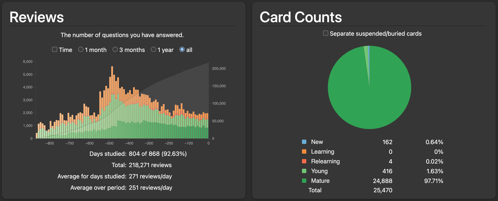
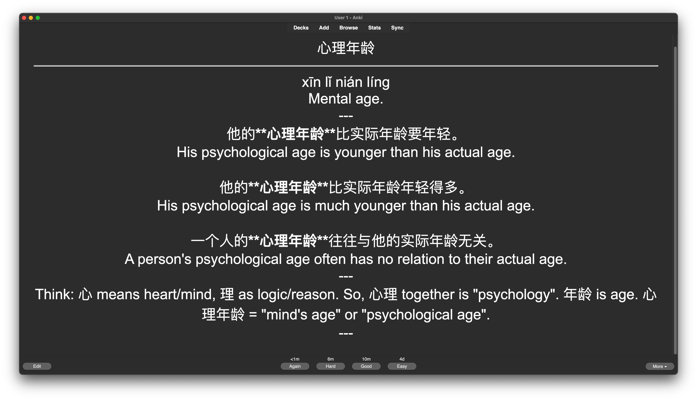
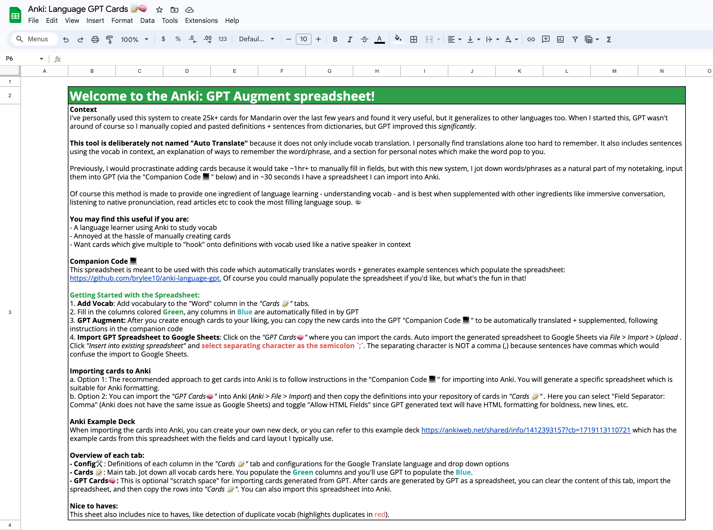

# Anki Language GPT: Auto-Generated Language Cards📚
Use GPT-4o to create Anki cards for language learning! 🌎

This code takes a file of vocab in a given language and generates translations, example sentences, and explanations of the word. This code can do this for 100s of cards in <30 seconds. Just add vocab, generate cards, and import to Anki.

I've personally used this system to create 25k+ cards for Mandarin over the last few years (personal Mandarin Anki history below) and found it very useful, but it generalizes to other languages too.



You may find this useful if you are:
- A language learner using Anki to study vocab
- Annoyed at the hassle of manually creating cards
- Want cards which give multiple to "hook" onto definitions with vocab used like a native speaker in context

Of course this method is made to provide one ingredient of language learning - understanding vocab - and is best when supplemented with other ingredients like immersive conversation, listening to native pronunciation, read articles etc to cook the most filling language soup. 🍲

Example Generated Card:



**⭐ Some notable features include:**
- The code has minimal prerequisites, so you can get your first set of cards created within minutes
- All card fields are auto generated with GPT-4o 
- Card generation is implemented asynchronously, so cards are created concurrently and quickly, limited only by the OpenAI API rate limit. With the lowest paid OpenAI tier, Tier 1, you can generate 500 cards in < 30 seconds.
- The generator supports outputting cards to Anki, Google Sheets, or Excel from an easily importable spreadsheet
- Anki cards have the foreign word bolded and surrounded by asterisks (**\*\*word\*\***) in example sentences to make the word easy to see in cards
- The foreign language and romanization is auto-detected by GPT from the "words to translate" by default

# Getting Started: Anki Language GPT Code
To use this code, 
1. Make sure you have an OpenAI API Key ([how to get an API key](https://community.openai.com/t/how-do-i-get-my-api-key/29343))
2. In a terminal, add this key to your environment 
```
# Linux, MacOS Terminal
export OPENAI_API_KEY="{YOUR API KEY}"
# Windows PowerShell
$env:OPENAI_API_KEY="{YOUR API KEY}"
```
3. `git clone` this repository locally and navigate to the `anki-language-gpt` directory
4. Make sure you have `python` and `pip` installed. Install the required python libraries via `pip install -r requirements.txt`
5. Add words to convert to cards in `cards/words_to_translate.txt`
6. Run
```shell
python3 python/anki_language_gpt.py
```
7. Your created cards will be output to 3 files by default, each of which is formatted to be import to a particular program: `cards/output_flashcards_anki.csv` (Anki), `cards/output_flashcards_google_sheets.csv` (Sheets), `cards/output_flashcards_excel.xlsx` (Excel). The CSV files (Anki and Google Sheets) have columns separated by semicolons (`;`), not (`,`) because generated sentences often have `,` which would be confused with the `,` column delimiter.

## Script Parameters
There are a number of script parameters which can be provided to customize the input/output files, language, output file type (Anki, Google Sheet, Excel), the maximum number of concurrent cards created, etc. These are documented in `python3 python/anki_language_gpt.py --help`

```
Usage: anki_language_gpt.py [OPTIONS]

  Takes words from a foreign language and generates supplementary info
  (english translation, sample sentences, etc.) in a format that can be
  imported into Anki as flashcards, or as a spreadsheet for Google Sheets or
  Excel.

Options:
  -i, --input-file TEXT           File with newline separated words to augment
                                  with GPT.
  -o, --output-file TEXT          Output spreadsheet for flashcards.
  --overwrite-output              Overwrite existing output file (appends by
                                  default)
  --language TEXT                 Language of the input words, e.g. chinese,
                                  arabic, french (any valid ISO-639 language
                                  name). If not provided, then GPT auto
                                  detects the language from the input words.
  --use-romanization BOOLEAN      Whether the language needs romanization. If
                                  not provided, then GPT auto detects
                                  romanization from the input words.
  --number-of-sentences INTEGER   Number of example sentences to generate per
                                  card
  --max-concurrent-cards INTEGER  Maximum number of cards to generate
                                  concurrently.
  --output-format [excel|sheets|anki]
                                  Customizes the output file format for an
                                  output source ("excel", "sheets", "anki").
                                  Excel output file must end in .xlsx and
                                  anki/sheets must end in .csv.
  --log-level [DEBUG|INFO|WARNING|ERROR|CRITICAL]
                                  Logging level (DEBUG, INFO, WARNING, ERROR,
                                  CRITICAL)
  --help                          Show this message and exit.
```

# Importing Generated Cards
The below describes importing the generated spreadsheet to various output sources.

## Anki
You can import generated flashcards directly to Anki or follow recommendations in the [Accompanying Resources](#accompanying-resources) to import them to a Google Sheet. The resources include an example Anki deck which uses these cards.

When importing to Ankim, set the column delimiter to be (`;`) and enable `Allow HTML in fields`. The delimiter is `;` and not `,` because many sentences have `,` in them. `Allow HTML` is needed since the HTML tags `<b>` is used to bold the foreign word for easy viewing.

## Google Sheets
The steps are largely similar to those for `Anki`. Generate a Google Sheet output (no HTML tags) via:

```shell
python3 python/anki_language_gpt.py --output-format sheets
```

Additional recommendations are listed in the [Accompanying Resources](#accompanying-resources) to import cards to a Google Sheet.

## Excel
Generate the cards via

```shell
python3 python/anki_language_gpt.py --output-file cards/output_flashcards.xlsx --output-format excel
```

The generated `.xlsx` file can be directly opened in Excel. The `Example Sentences` column may not show new lines between sentences by default, so you may need to double-click on the cell or select all cells and click "Home > Wrap Text" to cause Excel to register the  newlines.

## Multiple Outputs
Multiple output formats can be specified by specifying multiple `--output-file` and `--output-format`. These are associated pairwise. By default, Anki Language GPT is configured like the below to generate 3 output spreadsheets (`cards/output_flashcards_excel.xlsx`, `cards/output_flashcards_google_sheets.csv`, `cards/output_flashcards_anki.csv`) which can be imported to the respective programs. This means running `python3 python/anki_language_gpt.py` by default is equivalent to running the below.

```shell
python3 python/anki_language_gpt.py \
    --output-file cards/output_flashcards_excel.xlsx --output-format excel \
    --output-file cards/output_flashcards_google_sheets.csv --output-format sheets \
    --output-file cards/output_flashcards_anki.csv --output-format anki
```

# Accompanying Resources
This code makes assumptions about the schema of the output spreadsheet from GPT augmentation. It is intended to be used with this [Anki: Language GPT Cards 📝🧠](https://docs.google.com/spreadsheets/d/1M5Shgej_IWhwEwpzk5oymdCeKFzv8ajOAPE79CNc1y4/edit?usp=sharing). A typical workflow is described in the first page of the spreadsheet. Additionally, this [Anki deck](https://ankiweb.net/shared/info/1412393157?cb=1719113110721) is a small example of cards that can be created via this process.

<a href="https://docs.google.com/spreadsheets/d/1M5Shgej_IWhwEwpzk5oymdCeKFzv8ajOAPE79CNc1y4/edit?usp=sharing">
    
</a>

Using this spreadsheet is optional. You can also use this code as just a card generator.

# Error Resolutions

**Encountering `aiohttp.client_exceptions.ServerDisconnectedError: Server disconnected`**
* Handling: Rerun the program. This can be caused by OpenAI API server overload or transient network issues.
